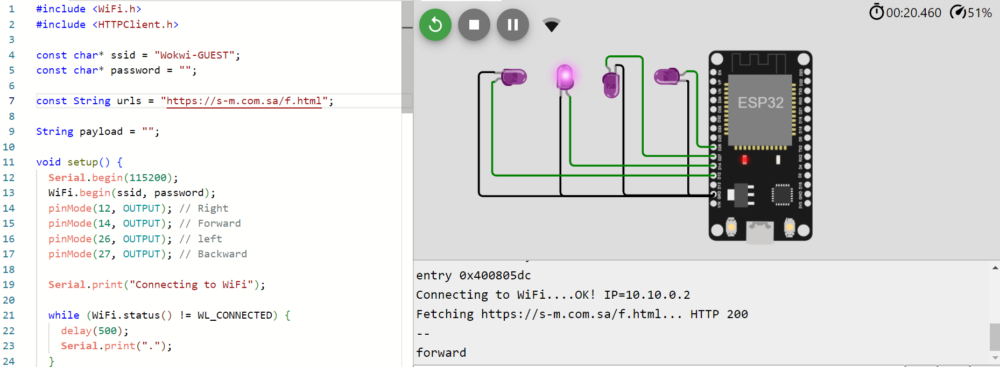
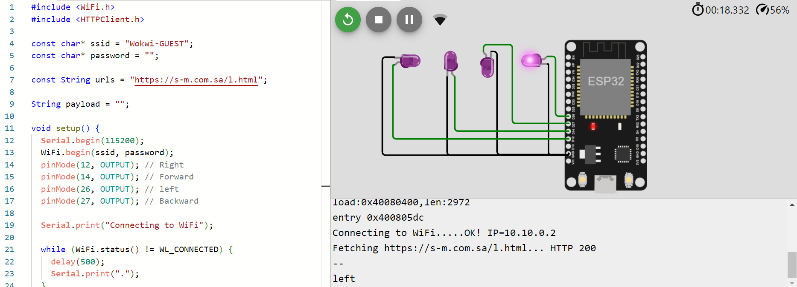
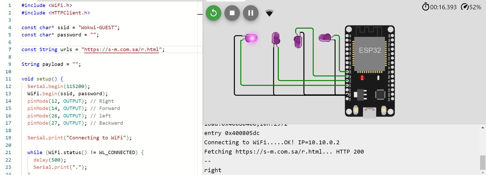

# Task1-IOT

 ### Idea:
 Turn on the required LED according to the word displayed in the html page


 ### Hardware Required:
 - 4 LEDs.
 - ESP.
 - Wires.

  
 ### Circuits:

 - When the html page contains the word forward
   
   


 - When the html page contains the word backward
   
   


 - When the html page contains the word left
   
   


 - When the html page contains the word right
   
   


   
  ### Code:
  
 ```
#include <WiFi.h>
#include <HTTPClient.h>

const char* ssid = "Wokwi-GUEST";
const char* password = "";

const String urls = "https://s-m.com.sa/f.html";
// const String urls = "https://s-m.com.sa/b.html";
// const String urls = "https://s-m.com.sa/l.html";
// const String urls = "https://s-m.com.sa/r.html";

String payload = "";

void setup() {
  Serial.begin(115200);
  WiFi.begin(ssid, password);
  pinMode(12, OUTPUT); // Right
  pinMode(14, OUTPUT); // Forward
  pinMode(26, OUTPUT); // left
  pinMode(27, OUTPUT); // Backward

  Serial.print("Connecting to WiFi");

  while (WiFi.status() != WL_CONNECTED) {
    delay(500);
    Serial.print(".");
  }

  Serial.print("OK! IP=");
  Serial.println(WiFi.localIP());

  Serial.print("Fetching " + urls + "... ");
}

void loop() {
  HTTPClient http; // Corrected class name
  http.begin(urls);
  int httpResponseCode = http.GET();
  if (httpResponseCode > 0 ){
    Serial.print("HTTP ");
    Serial.println(httpResponseCode);
    payload = http.getString();
    Serial.println("--");
    Serial.println(payload);
    if ( payload == "right"){
      digitalWrite(12, HIGH);
    }else{
      digitalWrite(12, LOW);
    }if ( payload == "forward"){
      digitalWrite(14, HIGH);
    }else{
      digitalWrite(14, LOW);
    }if ( payload == "left"){
      digitalWrite(26, HIGH);
    }else{
      digitalWrite(26, LOW);
    }if ( payload == "backward"){
      digitalWrite(27, HIGH);
    }else{
      digitalWrite(27, LOW);
    }
  }else{
    Serial.print("Error code: ");
    Serial.println(httpResponseCode);
    Serial.println(":-(");
  }
}


 ```

  ### Wokwi link:
  https://wokwi.com/projects/372148933518307329


  
